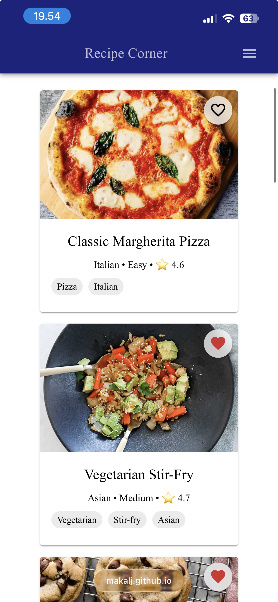
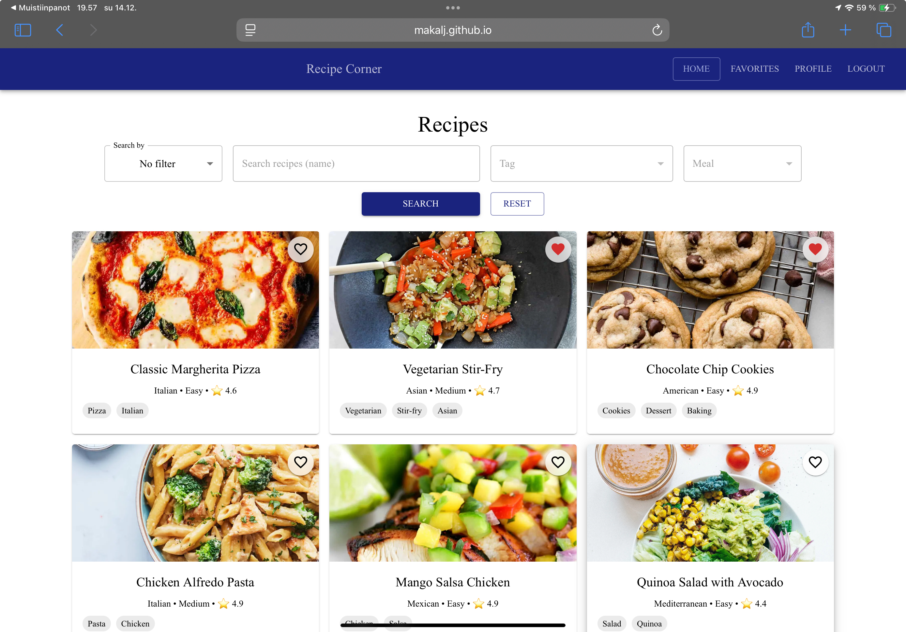
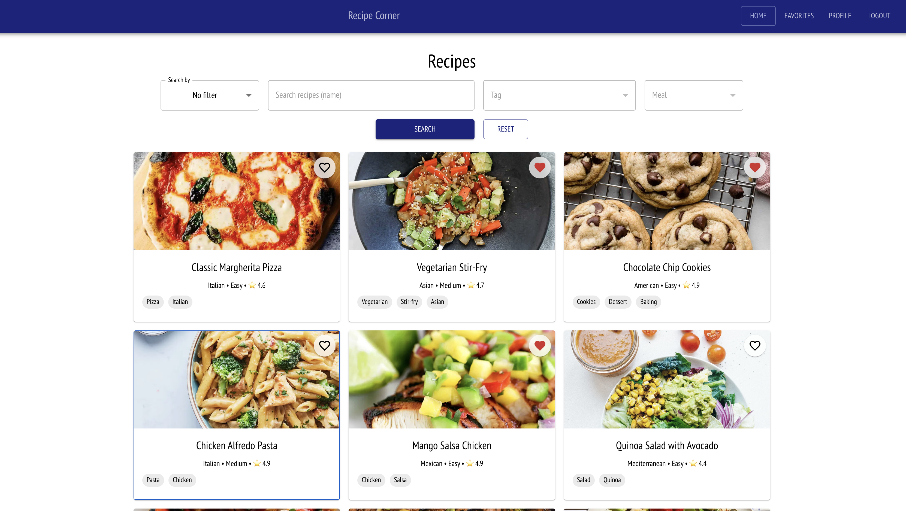
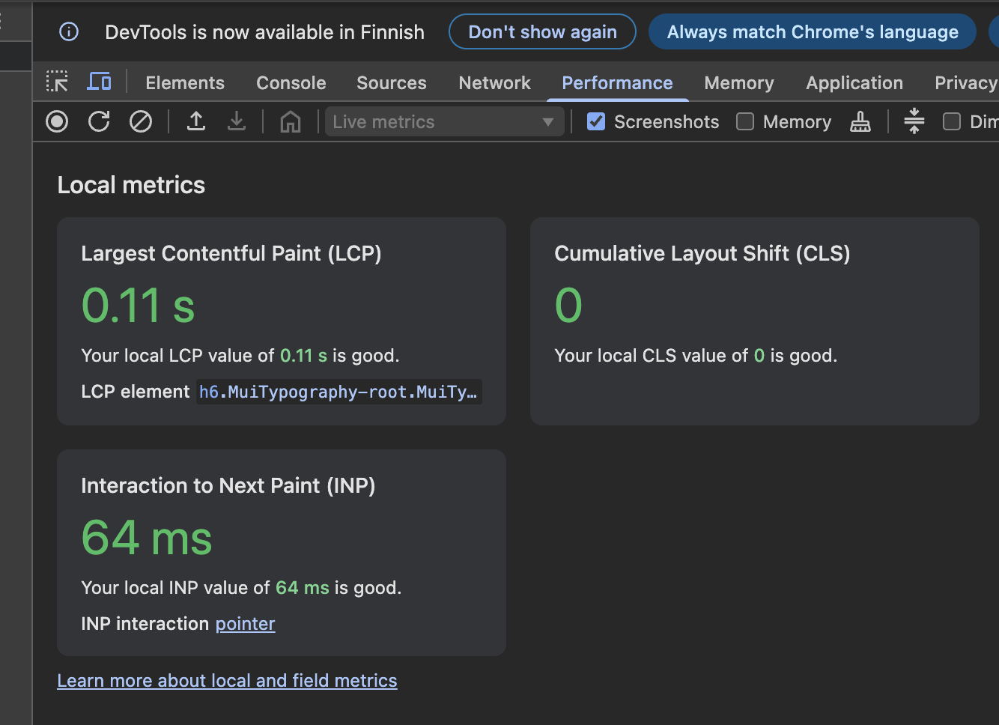
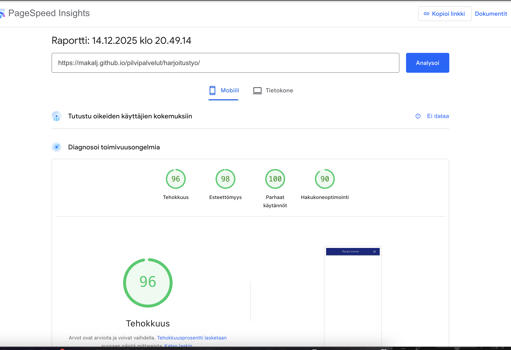
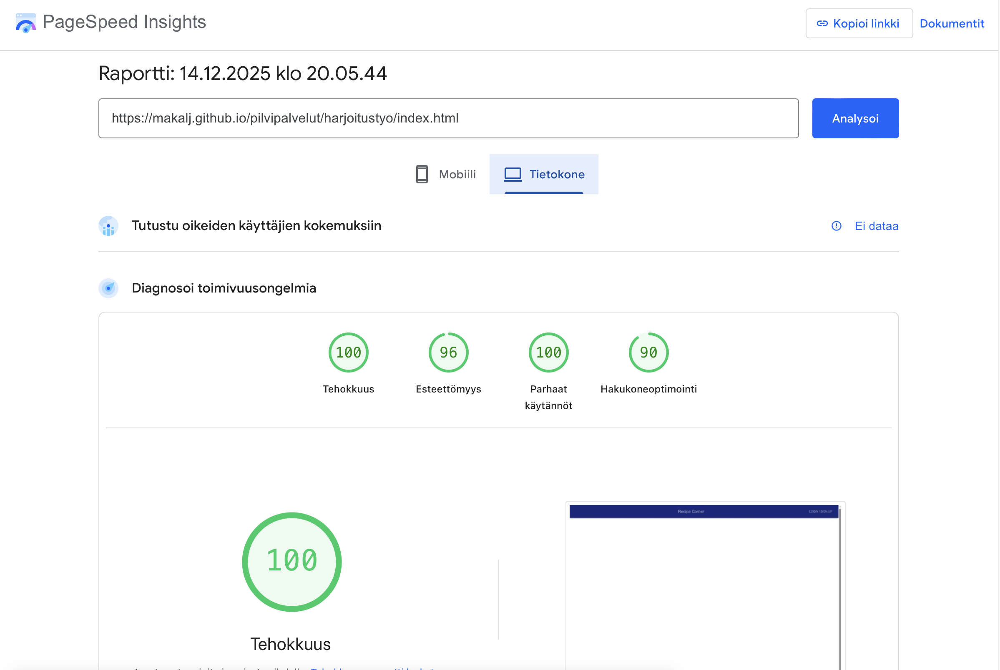

[⬅️ linkki takaisin etusivulle](index.md)

# Harjoitustyö

[linkki harjoitustyöhön](./harjoitustyo/index.html)

## Harjoitustyön testaus

### Responsiivisuus

Testattu toimivuus eri kokoisilla päätelaitteilla. 

**Testauksen tavoite:** varmistaa, että sivusto skaalautuu ja toimii eri näyttökoissa ilman, että sisältö leikkaantuu, elementit menevät päällekkäin tai navigointi muuttuu epäselväksi.
Toimivuus selaimilla

**Testatut näyttökoot:**
- Desktop: 1920×1080 ja 1366×768
- Tablet: 768×1024 (pysty) ja 1024×768 (vaaka)
- Mobiili: 375×667

**Tulokset:**
Testattu toimivuus eri kokoisilla päätelaitteilla. Toimii moitteettomasti kaikilla eri näytöillä. 

**Mobiili:**
Sivusto toimii hyvin mobiililaitteilla. Painikkeet sekä linkit ovat helposti käytettävissä.

   

**Tablet**
Sivusto skaalautuu oikein tablet-laitteilla. Teksti ja kuvat mukautuvat näytön kokoon, ja navigointi säilyy helppokäyttöisenä sekä pysty- että vaaka-asennossa.

**Desktop**
Sivusto toimii odotetusti suurilla näytöillä. Sisältö on selkeästi jäsennelty, eikä elementtien päällekkäisyyksiä tai skaalausongelmia havaittu.
 

### Toimivuus eri selaimilla

Sivusto on testattu uusimmilla selaimilla, sivusto toimi kaikilla selaimilla. 

**Testatut selaimet ja versiot:**
- Safari 26.1
- Microsoft Edge 143
- Mozilla Firefox 146
- Google Chrome 143

**Tulokset**
- Sivusto toimi kaikissa testatuissa selaimissa halutulla tavalla
- Navigointi, linkit ja sivujen lataus toimivat odotetusti.

### Sivujen latautumisaika

Sivujen latautumisaikaa tarkasteltiin selaimen kehittäjätyökaluilla. Sivusto latautui nopeasti sekä ensimmäisellä latauskerralla että uudelleen ladattaessa.

 

Testattu vielä PageSpeed Insight työkalulla: 

 
**Tulokset:**
- Sivujen lataus tapahtui kohtuullisessa ajassa.
- Sivusto reagoi nopeasti käyttäjän toimintoihin.
- Latausaikoihin vaikuttavia kriittisiä pullonkauloja ei havaittu.

### Yhteenveto

Testauksen perusteella sivusto toimii luotettavasti eri päätelaitteilla ja selaimilla. Sivusto on responsiivinen sekä yhteensopiva eri selainten kanssa. Käytettävyyteen tai toimivuuteen vaikuttavia merkittäviä ongelmia ei testauksen aikana havaittu.

